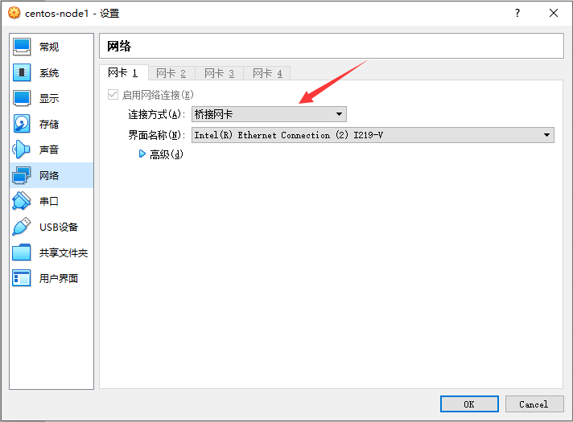

# VirtualBox

- [VirtualBox](#virtualbox)
  - [Install](#install)
    - [CentOS7](#centos7)
    - [Setting](#setting)
      - [network](#network)
      - [yum and epel](#yum-and-epel)

## Install

### CentOS7

- [CentOS-7-x86_64-Minimal-2009.iso](https://mirrors.aliyun.com/centos/7.9.2009/isos/x86_64/CentOS-7-x86_64-Minimal-2009.iso)

### Setting

#### network

- virtualbox

  

- network-scripts

  ```bash
  cd /etc/sysconfig/network-scripts/


  cat ifcfg-enp0s3
  ```

- BOOTPROTO=static

  ```conf
  TYPE=Ethernet
  PROXY_METHOD=none
  BROWSER_ONLY=no
  BOOTPROTO=static
  DEFROUTE=yes
  IPV4_FAILURE_FATAL=no
  IPV6INIT=yes
  IPV6_AUTOCONF=yes
  IPV6_DEFROUTE=yes
  IPV6_FAILURE_FATAL=no
  IPV6_ADDR_GEN_MODE=stable-privacy
  NAME=enp0s3
  UUID=53736d17-52b5-47c9-b042-138bc2eb1633
  DEVICE=enp0s3
  # default no
  ONBOOT=yes

  IPADDR=192.168.1.223
  GATEWAY=192.168.1.1
  NETMASK=255.255.255.0

  DNS1=114.114.114.114
  DNS2=8.8.8.8
  ```

- BOOTPROTO=dhcp

  ```conf
  TYPE=Ethernet
  PROXY_METHOD=none
  BROWSER_ONLY=no
  BOOTPROTO=dhcp
  DEFROUTE=yes
  IPV4_FAILURE_FATAL=no
  IPV6INIT=yes
  IPV6_AUTOCONF=yes
  IPV6_DEFROUTE=yes
  IPV6_FAILURE_FATAL=no
  IPV6_ADDR_GEN_MODE=stable-privacy
  NAME=enp0s3
  UUID=53736d17-52b5-47c9-b042-138bc2eb1633
  DEVICE=enp0s3
  # default no
  ONBOOT=yes

  DNS1=114.114.114.114
  DNS2=8.8.8.8
  ```

- network manager

  ```bash
  systemctl restart NetworkManager
  ```

- test

  ```bash
  ping www.baidu.com
  ```

#### yum and epel

- [yum](https://developer.aliyun.com/mirror/centos)

  ```bash
  mv /etc/yum.repos.d/CentOS-Base.repo /etc/yum.repos.d/CentOS-Base.repo.backup
  curl -o /etc/yum.repos.d/CentOS-Base.repo https://mirrors.aliyun.com/repo/Centos-7.repo
  ```

- [epel](https://developer.aliyun.com/mirror/epel)

  ```bash
  mv /etc/yum.repos.d/epel.repo /etc/yum.repos.d/epel.repo.backup
  mv /etc/yum.repos.d/epel-testing.repo /etc/yum.repos.d/epel-testing.repo.backup

  wget -O /etc/yum.repos.d/epel.repo http://mirrors.aliyun.com/repo/epel-7.repo
  ```
