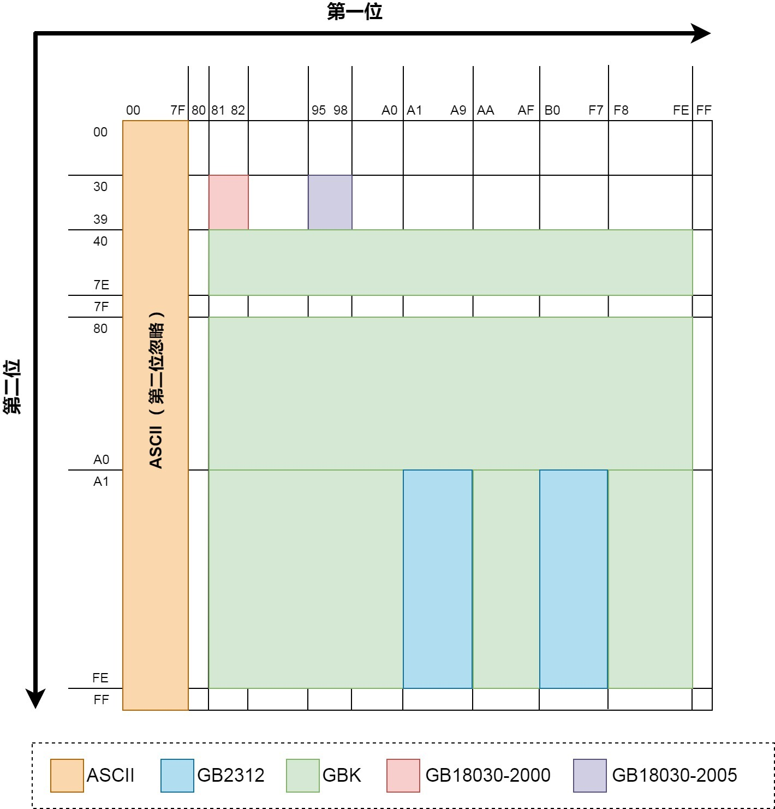

# Codes

## 一图弄懂ASCII、GB2312、GBK、GB18030编码

先介绍一下ASCII，GB2312，GBK和GB18030编码。

之所以把这几个放在一起介绍，是因为他们的相关性非常强。兼容性关系是GB18030兼容GBK，GBK兼容GB2312，GB2312兼容ASCII。所谓兼容，你可以简单理解为子集、不冲突的关系。例如GB2312编码的文件中可以出现ASCII字符，GBK编码的文件中可以出现GB2312和ASCII字符，GB18030编码的文件可以出现GBK、GB2312、ASCII字符。

每种编码方式的特点：

【1】ASCII 每个字符占据1bytes，用二进制表示的话最高位必须为0（扩展的ASCII不在考虑范围内），因此ASCII只能表示128个字

【2】GB2312 最早一版的中文编码，每个字占据2bytes。由于要和ASCII兼容，那这2bytes最高位不可以为0了（否则和ASCII会有冲突）。在GB2312中收录了6763个汉字以及682个特殊符号，已经囊括了生活中最常用的所有汉字。

【3】GBK 由于GB2312只有6763个汉字，我汉语博大精深，只有6763个字怎么够？于是GBK中在保证不和GB2312、ASCII冲突（即兼容GB2312和ASCII）的前提下，也用每个字占据2bytes的方式又编码了许多汉字。经过GBK编码后，可以表示的汉字达到了20902个，另有984个汉语标点符号、部首等。值得注意的是这20902个汉字还包含了繁体字。

【4】GB18030 然而，GBK的两万多字也已经无法满足我们的需求了，还有更多可能你自己从来没见过的汉字需要编码。这时候显然只用2bytes表示一个字已经不够用了（2bytes最多只有65536种组合，然而为了和ASCII兼容，最高位不能为0就已经直接淘汰了一半的组合，只剩下3万多种组合无法满足全部汉字要求）。因此GB18030多出来的汉字使用4bytes编码。当然，为了兼容GBK，这个四字节的前两位显然不能与GBK冲突（实操中发现后两位也并没有和GBK冲突）。我国在2000年和2005年分别颁布的两次GB18030编码，其中2005年的是在2000年基础上进一步补充。至此，GB18030编码的中文文件已经有七万多个汉字了，甚至包含了少数民族文字。

你一定比较好奇这些中文编码是如何做到“兼容”的，我们来看下图：

这图中展示了前文所述的几种编码在编码完成后，前2个byte的值的范围（用16进制表示）。每个byte可以表示00到FF（即0至255）。从图中我们可以一目了然地看到为什么GB18030可以兼容GBK，GB2312和ASCII了。他们几种编码之间前两位没有重合部分。需要注意的是ASCII只有1byte，所以是没有第二位的。另外GB18030在上图中占的面积虽然很小，但是它是4bytes编码，这图只展示了前两位。如果后两位也算上，GB18030的字数要远多于GBK。另外需要注意的是，由于GBK兼容GB2312，因此属于GB2312的蓝色区域其实也可以算作是GBK的区域。同理GBK的区域理论上也属于GB18030的区域。上表中只是展示了多出来的部分。

## 通信协议中的转义字符

作用：在通信协议中用在协议中使得通信的内容更加安全可靠。

举例说明：假设现在需要定制一个通信协议，需要的最基本的就是一个帧头和帧尾的标志，因为通信的接收方才知道什么时候是通信的开始和结束。

那么假设`帧头（通信的开始）为0x02`（也可以是其他），`帧尾为0x03`（也可以是其他），粗略的一看是没有问题的，

但是试想如果在帧头和帧尾的中间数据出现0x02或者0x03的时候整个通信过程将会被破坏掉，因为本来一帧数据还没有传输完成，接收方误以为接收到帧头或者帧尾就会重新开始接收数据（导致前面已经接收的数据丢失）或者结束接收数据（导致后面的数据无法接收）。理论上来讲帧头和帧尾无论定义为什么字符都会可能出在通信数据中，因为我们不应该对用户传输的通信数据做出任何的假设。那么如何解决这个问题呢？

转义字符就是用来解决这个问题的，先看下面的这张图片：

STX is short for "start of text"

ETX is short for "end of text"

ESC is short for "escape character"

| 转义前             | 转义后               |
|-----------------|-------------------|
| STX - 0x02(帧头)  | STX 转成 ESC 和 0xE7 |
| ETX - 0x03(帧尾)  | ETX 转成 ESC 和 0xE8 |
| ESC - 0x02(转义符) | ESC 转成 ESC 和 0x00 |

解释：

如果包体中出现0x02就转换成 0x1B 0xE7

如果包体中出现0x03就转换成 0x1B 0xE8

如果包体中出现0x1B就转换成 0x1B 0x00

这张图片中再加入了一个字符即0x1B，这个字符被定义为转义字符（也可以设置为别的），加入这个字符后的传输过程变为，0x02+用户数据+0x03，

但是在用户数据中如果`出现0x02即被替换为0x1B+0xE7`，如果`出现0x03即被替换为0x1B+0xE8`，这样用户数据中就绝不会再出现0x02和0x03。

但是万一用户要传输的数据就是0x1B+0xE7呢？这也没有关系，因为如果用户要传输的0x1B也会被转义为0x1B+0x00，

所以`假设用户真的需要传输0x1B+0xE7的话也被0x1B+0x00+0xE7所替代`，也不会造成干扰。

这样做的结果是在接收端如果接收到转义字符，就必须要判断下一个字符是否为特定的三个值，如果是特定的三个值就需要做特殊处理，这就是转义字符解决通信中防止通信错误的原理。

## Referrence

[一图弄懂ASCII、GB2312、GBK、GB18030编码](https://cloud.tencent.com/developer/article/1343240)

[通信协议中的转义字符](https://www.cnblogs.com/chucklu/p/6428615.html)
