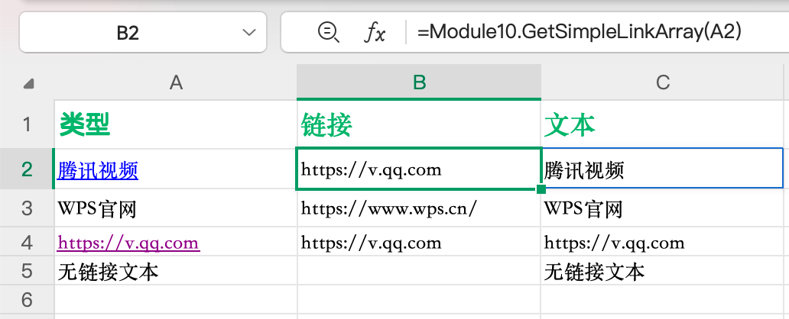
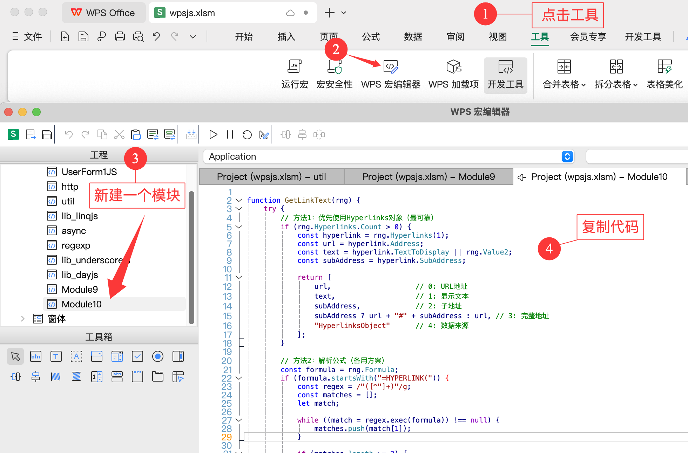

当我们的 `WPS` 表格中有些单元格包含一些超链接(URL)时，可能需要提取出其中的超链接并放在单独的一列中，可以通过自定义 `WPS JSA` 函数来实现这一功能。这样的话，效率加倍。

`效果：`



`分享的代码：`

```js
function GetLinkText(rng) {
  try {
    // 方法1：优先使用Hyperlinks对象（最可靠）
    if (rng.Hyperlinks.Count > 0) {
      const hyperlink = rng.Hyperlinks(1);
      const url = hyperlink.Address;
      const text = hyperlink.TextToDisplay || rng.Value2;
      const subAddress = hyperlink.SubAddress;

      return [
        url, // 0: URL地址
        text, // 1: 显示文本
        subAddress, // 2: 子地址
        subAddress ? url + "#" + subAddress : url, // 3: 完整地址
        "HyperlinksObject", // 4: 数据来源
      ];
    }

    // 方法2：解析公式（备用方案）
    const formula = rng.Formula;
    if (formula.startsWith("=HYPERLINK(")) {
      const regex = /"([^"]+)"/g;
      const matches = [];
      let match;

      while ((match = regex.exec(formula)) !== null) {
        matches.push(match[1]);
      }

      if (matches.length >= 2) {
        return [
          matches[0], // URL地址
          matches[1], // 显示文本
          "", // 子地址
          matches[0], // 完整地址
          "FormulaParser", // 数据来源
        ];
      } else if (matches.length === 1) {
        return [
          matches[0], // URL地址
          rng.Value2, // 显示文本
          "", // 子地址
          matches[0], // 完整地址
          "FormulaParser", // 数据来源
        ];
      }
    }

    // 方法3：检查单元格值是否为URL格式
    const cellValue = rng.Value2;
    if (cellValue && /^https?:\/\/|^www\./i.test(cellValue)) {
      return [
        cellValue, // URL地址
        cellValue, // 显示文本
        "", // 子地址
        cellValue, // 完整地址
        "CellValue", // 数据来源
      ];
    }

    // 没有找到超链接
    return [
      "", // URL地址
      cellValue, // 显示文本
      "", // 子地址
      "", // 完整地址
      "NoHyperlink", // 数据来源
    ];
  } catch (error) {
    // 错误处理
    return [
      "", // URL地址
      rng.Value2, // 显示文本
      "", // 子地址
      "", // 完整地址
      "Error: " + error.message, // 数据来源
    ];
  }
}

// 简化版本：只返回URL和文本的数组
function GetSimpleLinkArray(rng) {
  const result = GetLinkText(rng);
  return [result[0], result[1]]; // 只返回URL和文本
}
```

`接下来插入代码：`



保存并关闭`WPS 宏编辑器`后，再在单元格输入公式 `=GetSimpleLinkArray(B2)`, 最后向下填充即可。得益于 `WPS` 的数组公式，所以可以得到`链接`和`文本`两部分内容。

`如：`


