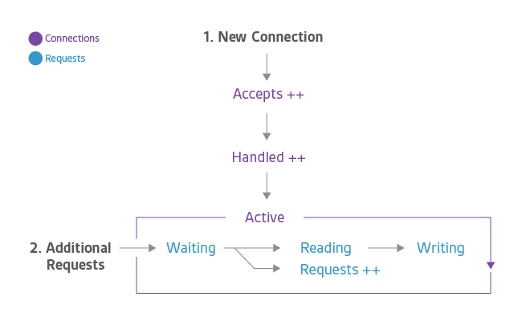

# Nginx

- [Nginx](#nginx)
  - [document](#document)
  - [gcc](#gcc)
  - [install nginx by bash](#install-nginx-by-bash)
  - [install nginx by bash with versioning](#install-nginx-by-bash-with-versioning)
  - [start nginx](#start-nginx)
  - [nginx systemd service file](#nginx-systemd-service-file)
  - [add module](#add-module)
  - [clean nginx log](#clean-nginx-log)
    - [clean script](#clean-script)
    - [crontab](#crontab)
  - [learn nginx](#learn-nginx)
    - [Starting, Stopping, and Reloading Configuration](#starting-stopping-and-reloading-configuration)
    - [Resource](#resource)
  - [docker](#docker)
  - [Problem](#problem)

## document

[@CentOS7](https://www.centos.org/)

[nginx docs](http://nginx.org/en/docs/)

[nginx configure](http://nginx.org/en/docs/configure.html)

## gcc

```bash
# 可能需要安装C++
yum -y install gcc-c++
```

## install nginx by bash

```bash

cd /usr/local/src

#
# @see http://nginx.org/en/download.html
#
wget http://nginx.org/download/nginx-1.15.11.tar.gz

tar -xzvf nginx-1.15.11.tar.gz

#
# @see http://www.pcre.org/
#
wget https://ftp.pcre.org/pub/pcre/pcre-8.43.tar.gz

tar -xzvf pcre-8.43.tar.gz

#
# @see https://www.openssl.org/source/
#
wget https://www.openssl.org/source/openssl-1.0.2r.tar.gz

tar -xzvf openssl-1.0.2r.tar.gz

#
# @see http://www.zlib.net/
#
wget http://www.zlib.net/zlib-1.2.11.tar.gz

tar -xzvf zlib-1.2.11.tar.gz


# 重点来了！！！
cd nginx-1.15.11

./configure --prefix=/usr/local/nginx --with-http_ssl_module --with-pcre=../pcre-8.43 \
--with-zlib=../zlib-1.2.11 --with-openssl=../openssl-1.0.2r

make && make install

test -e /usr/bin/nginx || ln -s /usr/local/nginx/sbin/nginx /usr/bin/nginx
```

## install nginx by bash with versioning

```bash
cd /usr/local/src

nginx_version=1.16.1
pcre_version=8.43
openssl_version=1.1.1d
zlib_version=1.2.11

#
# @see http://nginx.org/en/download.html
#
wget http://nginx.org/download/nginx-${nginx_version}.tar.gz

tar -xzvf nginx-${nginx_version}.tar.gz

#
# @see http://www.pcre.org/
#
wget https://ftp.pcre.org/pub/pcre/pcre-${pcre_version}.tar.gz

tar -xzvf pcre-${pcre_version}.tar.gz

#
# @see https://www.openssl.org/source/
#
wget https://www.openssl.org/source/openssl-${openssl_version}.tar.gz

tar -xzvf openssl-${openssl_version}.tar.gz

#
# @see http://www.zlib.net/
#
wget http://www.zlib.net/zlib-${zlib_version}.tar.gz

tar -xzvf zlib-${zlib_version}.tar.gz


# 重点来了！！！
cd nginx-${nginx_version}

./configure --prefix=/usr/local/nginx \
--with-http_stub_status_module \
--with-http_ssl_module \
--with-pcre=../pcre-${pcre_version} \
--with-zlib=../zlib-${zlib_version} \
--with-openssl=../openssl-${openssl_version}

make && make install

test -e /usr/bin/nginx || ln -s /usr/local/nginx/sbin/nginx /usr/bin/nginx
# nginx user
# useradd -M -s /sbin/nologin nginx
```

## start nginx

```bash
# 开启端口(permanent永久)
firewall-cmd --zone=public --add-port=80/tcp --permanent
firewall-cmd --zone=public --add-port=443/tcp --permanent

# 重启firewall生效
firewall-cmd --reload
# 查看开启的端口
firewall-cmd --list-ports

# 符号链接
test -e /usr/bin/nginx || ln -s /usr/local/nginx/sbin/nginx /usr/bin/nginx

# start
nginx
```

## nginx systemd service file

[nginx systemd service file](https://www.nginx.com/resources/wiki/start/topics/examples/systemd/)

The location of the PIDFile and the NGINX binary may be different depending on how NGINX was compiled.

Save this file as /lib/systemd/system/nginx.service

```systemd
[Unit]
Description=The NGINX HTTP and reverse proxy server
After=syslog.target network.target remote-fs.target nss-lookup.target

[Service]
Type=forking
PIDFile=/usr/local/nginx/logs/nginx.pid
ExecStartPre=/usr/local/nginx/sbin/nginx -t
ExecStart=/usr/local/nginx/sbin/nginx
ExecReload=/usr/local/nginx/sbin/nginx -s reload
ExecStop=/bin/kill -s QUIT $MAINPID
PrivateTmp=true

[Install]
WantedBy=multi-user.target
```

```bash
# 开机启动
systemctl enable nginx

# 立即启动
systemctl start nginx
```

## add module

以`--with-stream=dynamic`为例，`--add-module`类似

```bash
#
# 查看nginx详细安装信息
#
nginx -V
# nginx version: nginx/1.15.11
# built by gcc 4.8.5 20150623 (Red Hat 4.8.5-36) (GCC)
# built with OpenSSL 1.0.2r  26 Feb 2019
# TLS SNI support enabled
# configure arguments: --prefix=/usr/local/nginx --with-http_ssl_module --with-http_sub_module \
# --with-http_gzip_static_module --with-http_stub_status_module \
# --with-pcre=../pcre-8.43 --with-zlib=../zlib-1.2.11/ --with-openssl=../openssl-1.0.2r

#
# whereis nginx 查看本机是否存在nginx源码目录
# 若没有，下载对应版本的源，如nginx
# cd /usr/local/src
# nginx_version=1.15.11
# wget http://nginx.org/download/nginx-${nginx_version}.tar.gz
#

cd /usr/local/src/nginx-1.15.11
# 将配置输出到ngx_config.sh
nginx -V 2>&1 | awk '{print $0}' > ngx_config.sh

# --with-stream=dynamic
vim ngx_config.sh
#./configure --prefix=/usr/local/nginx --with-http_ssl_module --with-http_sub_module \
# --with-http_gzip_static_module --with-http_stub_status_module \
# --with-pcre=../pcre-8.43 --with-zlib=../zlib-1.2.11/ --with-openssl=../openssl-1.0.2r --with-stream=dynamic

chmod 755 ngx_config.sh

bash ngx_config.sh

# 只执行make
make

# copy
cp /usr/local/nginx/sbin/nginx{,.bak}
cp ./objs/nginx /usr/local/nginx/sbin/
cp ./objs/ngx_stream_module.so /usr/local/nginx/modules/

# 编辑nginx.conf
vim /usr/local/nginx/conf/nginx.conf
# 顶层添加如下指令
# load_module modules/ngx_stream_module.so;

# 重新加载配置
nginx -s reload
```

## clean nginx log

```bash
# pwd
cd /usr/local/nginx
```

### clean script

```bash
vim clean_access_log.sh
```

```bash
#! /bin/bash

NGINX_LOG_DIR="/usr/local/nginx/logs"

cat /dev/null > ${NGINX_LOG_DIR}/access.log
cat /dev/null > ${NGINX_LOG_DIR}/company.access.log
cat /dev/null > ${NGINX_LOG_DIR}/show.access.log
cat /dev/null > ${NGINX_LOG_DIR}/api.access.log
#echo $(date '+%F %T') >> ${NGINX_LOG_DIR}/crontab.log
```

```bash
chmod 755 clean_access_log.sh
```

### crontab

```bash
crontab -e
```

```bash
# 每天凌晨3点清理
0 3 * * * /usr/local/nginx/clean_access_log.sh
```

## learn nginx

[Beginner’s Guide](http://nginx.org/en/docs/beginners_guide.html)

### Starting, Stopping, and Reloading Configuration

To start nginx, run the executable file. Once nginx is started, it can be controlled by invoking the executable with the -s parameter. Use the following syntax:

> nginx -s signal

Where signal may be one of the following:

- stop — fast shutdown
- quit — graceful shutdown
- reload — reloading the configuration file
- reopen — reopening the log files

For example, to stop nginx processes with waiting for the worker processes to finish serving current requests, the following command can be executed:

> nginx -s quit

This command should be executed under the same user that started nginx.
Changes made in the configuration file will not be applied until the command to reload configuration is sent to nginx or it is restarted. To reload configuration, execute:

> nginx -s reload

Once the master process receives the signal to reload configuration, it checks the syntax validity of the new configuration file and tries to apply the configuration provided in it. If this is a success, the master process starts new worker processes and sends messages to old worker processes, requesting them to shut down. Otherwise, the master process rolls back the changes and continues to work with the old configuration. Old worker processes, receiving a command to shut down, stop accepting new connections and continue to service current requests until all such requests are serviced. After that, the old worker processes exit.

### Resource

[nginx location中uri 的截取](https://www.jianshu.com/p/849a6c068daa)

[关于一些对location认识的误区](https://www.cnblogs.com/lidabo/p/4169396.html)

[nginx 常用模块整理](https://www.cnblogs.com/fangfei9258/p/9453709.html)

[zabbix ZBX_NGINX](https://github.com/AlexGluck/ZBX_NGINX)



[如何监控 NGINX](https://linux.cn/article-5970-1.html)

[SSL under IE8/Windows XP with NGINX and OpenSSL](https://ablagoev.github.io/ssl/nginx/ie8/winxp/cipher/2016/12/23/ie8-winxp-nginx-ssl.html)

nginx.conf

- ssl_ciphers "EECDH+AESGCM:EDH+AESGCM:ECDHE-RSA-AES128-GCM-SHA256:AES256+EECDH:DHE-RSA-AES128-GCM-SHA256:AES256+EDH:ECDHE-RSA-AES256-GCM-SHA384:DHE-RSA-AES256-GCM-SHA384:ECDHE-RSA-AES256-SHA384:ECDHE-RSA-AES128-SHA256:ECDHE-RSA-AES256-SHA:ECDHE-RSA-AES128-SHA:DHE-RSA-AES256-SHA256:DHE-RSA-AES128-SHA256:DHE-RSA-AES256-SHA:DHE-RSA-AES128-SHA:ECDHE-RSA-DES-CBC3-SHA:EDH-RSA-DES-CBC3-SHA:AES256-GCM-SHA384:AES128-GCM-SHA256:AES256-SHA256:AES128-SHA256:AES256-SHA:AES128-SHA:DES-CBC3-SHA:HIGH:!aNULL:!eNULL:!EXPORT:!DES:!MD5:!PSK:!RC4";

compile

- --with-openssl-opt=enable-weak-ssl-ciphers

## docker

[docker hub](https://hub.docker.com/_/nginx)

```bash
# nginx
mkdir /usr/local/nginx
# conf
mkdir /usr/local/nginx/conf
# logs
mkdir /usr/local/nginx/logs
# html
mkdir /usr/local/nginx/html
```

```bash
# vim /usr/local/nginx/conf/nginx.conf
```

```nginx
#user  nobody;
worker_processes  1;

#error_log  logs/error.log;
#error_log  logs/error.log  notice;
#error_log  logs/error.log  info;

#pid        logs/nginx.pid;


events {
    worker_connections  1024;
}


http {
    include       mime.types;
    default_type  application/octet-stream;

    #log_format  main  '$remote_addr - $remote_user [$time_local] "$request" '
    #                  '$status $body_bytes_sent "$http_referer" '
    #                  '"$http_user_agent" "$http_x_forwarded_for"';

    #access_log  logs/access.log  main;

    sendfile        on;
    #tcp_nopush     on;

    #keepalive_timeout  0;
    keepalive_timeout  65;

    #gzip  on;

    server {
        listen       80;
        server_name  localhost;

        #charset koi8-r;

        #access_log  logs/host.access.log  main;

        location / {
            root   html;
            index  index.html index.htm;
        }

        #error_page  404              /404.html;

        # redirect server error pages to the static page /50x.html
        #
        error_page   500 502 503 504  /50x.html;
        location = /50x.html {
            root   html;
        }

        # proxy the PHP scripts to Apache listening on 127.0.0.1:80
        #
        #location ~ \.php$ {
        #    proxy_pass   http://127.0.0.1;
        #}

        # pass the PHP scripts to FastCGI server listening on 127.0.0.1:9000
        #
        #location ~ \.php$ {
        #    root           html;
        #    fastcgi_pass   127.0.0.1:9000;
        #    fastcgi_index  index.php;
        #    fastcgi_param  SCRIPT_FILENAME  /scripts$fastcgi_script_name;
        #    include        fastcgi_params;
        #}

        # deny access to .htaccess files, if Apache's document root
        # concurs with nginx's one
        #
        #location ~ /\.ht {
        #    deny  all;
        #}
    }


    # another virtual host using mix of IP-, name-, and port-based configuration
    #
    #server {
    #    listen       8000;
    #    listen       somename:8080;
    #    server_name  somename  alias  another.alias;

    #    location / {
    #        root   html;
    #        index  index.html index.htm;
    #    }
    #}


    # HTTPS server
    #
    #server {
    #    listen       443 ssl;
    #    server_name  localhost;

    #    ssl_certificate      cert.pem;
    #    ssl_certificate_key  cert.key;

    #    ssl_session_cache    shared:SSL:1m;
    #    ssl_session_timeout  5m;

    #    ssl_ciphers  HIGH:!aNULL:!MD5;
    #    ssl_prefer_server_ciphers  on;

    #    location / {
    #        root   html;
    #        index  index.html index.htm;
    #    }
    #}

}
```

```bash
docker run -d --name nginx7 \
-v /usr/local/nginx/conf/nginx.conf:/etc/nginx/nginx.conf \
-v /usr/local/nginx/logs:/etc/nginx/logs \
-v /usr/local/nginx/html:/etc/nginx/html \
-p 80:80 -p 443:443 \
nginx:1.17.9
```

## Problem

- 在 `nginx 1.12.2` 版本配置upstream时, 可以使用upstream `backend_service` 这样的名称（包含下划线）来命名，但 `nginx 1.16.1` 命名 upstream 时由不能带`下划线`
