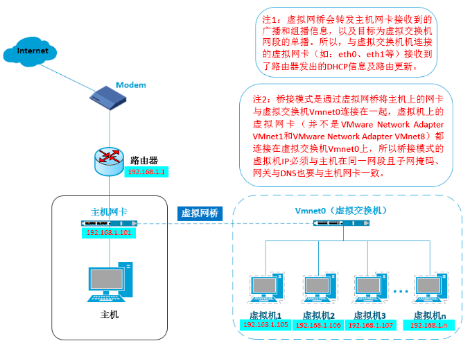
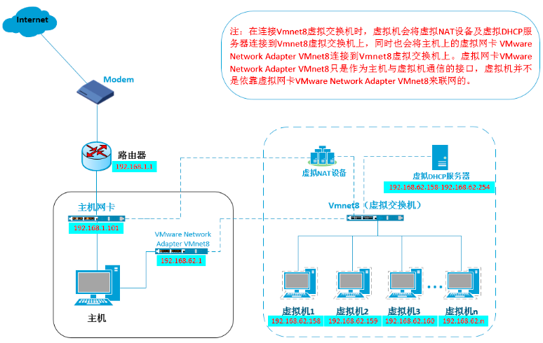
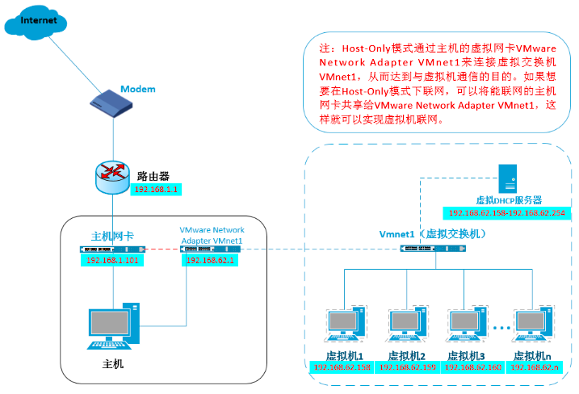

# VMware

- [VMware](#vmware)
  - [VMware 虚拟机的三种网络模式](#vmware-虚拟机的三种网络模式)
    - [Bridge](#bridge)
    - [NAT](#nat)
    - [Host-Only](#host-only)
  - [Resources](#resources)

## VMware 虚拟机的三种网络模式

### Bridge

### NAT

### Host-Only

## Resources

- [VMware 虚拟机的三种网络模式怎么选？](https://blog.csdn.net/a__int__/article/details/111208626)
